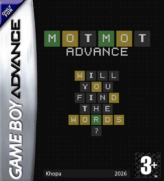
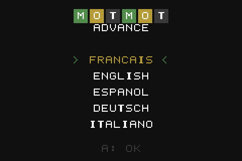

# MotMot Advance

*English version: [README.md](README.md)*

Un jeu de lettres pour la Game Boy Advance.



<p align="center"></p>

[Bande-annonce (mp4)](assets/market/Mot.Mot.Advance-thumb-video.mp4)

| Titre | Menu | Partie | Marathon | Time Attack |
|---|---|---|---|---|
|  |  |  |  |  |

## Fonctionnalités

- Choix de la langue au démarrage
- **Mode Classique** : mot tiré au hasard parmi ~500 mots courants, sans
  répéter les 8 derniers mots joués.
- **Mode Marathon** : des mots aléatoires enchaînés, avec des vies et un
  record sauvegardé par difficulté. Facile : 3 vies, un mot raté en coûte
  une. Difficile : 5 vies, mais chaque essai à partir du troisième en coûte une.
- **Time Attack** : 5, 10 ou 15 mots le plus vite possible
- Validation des mots contre une liste large par langue (4 900 à 8 700 mots).
- Statistiques persistantes dans la cartouche (SRAM)

## Contrôles

| Touche | Action |
|---|---|
| D-pad | Déplacer le curseur sur le clavier virtuel / naviguer dans les menus |
| A | Saisir la lettre sélectionnée (ou activer Entrée / Effacer sur le clavier) |
| B | Effacer la dernière lettre |
| START | Valider le mot |
| SELECT | Quitter la partie — une fenêtre modale demande confirmation et masque la grille. En Time Attack pas de pause : SELECT abandonne immédiatement |
| Gauche / Droite | Modifier une option, tourner les pages des Records, passer d'une initiale à l'autre |

## Compilation

Prérequis : [devkitPro](https://devkitpro.org/wiki/Getting_Started) avec le
groupe `gba-dev` (devkitARM, libtonc, gbafix), GNU make, Python 3 avec
[Pillow](https://pypi.org/project/pillow/) (génération des tuiles).

```sh
make            # -> build/motmot.gba
make run        # lance la ROM dans mGBA (variable MGBA pour changer le chemin)
make test       # tests unitaires sur PC (tests/unit)
make emutest    # scénarios joués dans mGBA (tests/emu)
make check      # les deux
make demo       # réenregistre docs/demo.gif et docs/demo_en.gif dans mGBA
make clean
```

Sous Windows, lancer `make` depuis le shell MSYS2 fourni par devkitPro
(`DEVKITPRO=/opt/devkitpro`). Si Python n'est pas dans le PATH de ce shell :
`make PYTHON="py -3"`.

La ROM déclare une sauvegarde SRAM (`SRAM_V113`) ; mGBA et les linkers de
flashcart la détectent automatiquement.

## Chaîne de traitement des assets

Tout ce qui est généré l'est à la compilation, dans `build/gen/` :

| Script | Rôle |
|---|---|
| `tools/make_assets.py` | Dessine les images sources `assets/*.png` (PNG indexés) à partir de pixel-art ASCII : police 6×7 (A-Z, 0-9, ponctuation, icônes Entrée/Effacer, segment de barre), cases 16×16 de la grille et touches arrondies du clavier avec la lettre pré-composée, sprite curseur, motif de fond du titre. `make assets` pour les régénérer. |
| `tools/png2gba.py` | Convertit un PNG en tuiles 4bpp + palette BGR555 sous forme de tableaux C. Option `--meta 2 2` (via `assets/<nom>.opts`) pour émettre les tuiles par métatuile 16×16. |
| `tools/gen_wordlist.py` | Transforme `data/<langue>_solutions.txt` et `data/<langue>_valid.txt` en tableaux C : solutions et mots valides triés (recherche dichotomique). |
| `tools/build_wordlists.py` | Reconstruit les fichiers `data/*.txt` depuis les sources externes (réseau nécessaire, `make wordlists`). |
| `tools/make_demo.py` | Enregistre `docs/demo.gif` (français) et `docs/demo_en.gif` (anglais) : joue `tools/demo.lua` dans mGBA via la bibliothèque de test, une image capturée sur trois (`make demo`). |

## Architecture

```
source/main.c        boucle de jeu et écrans : langue / titre / menu / options / records / sélection de mode / jeu / résultats / stats
source/logic.c       règles du jeu (score avec lettres répétées, validation, saisie) — sans dépendance matérielle
source/lang.c        table des langues : listes de mots, disposition clavier, textes
source/render.c      Mode 0 : BG0 texte, BG1 grille + clavier, BG2 motif titre, sprite curseur
source/sound.c       effets sonores PSG : séquenceur à pas sur carré 1, carré 2 et bruit
source/keyboard.c    navigation du curseur sur le clavier virtuel
source/input.c       lecture des touches, auto-répétition du D-pad
source/stats.c       lecture / écriture SRAM (statistiques, état du RNG, options)
source/rng.c         xorshift32
source/time_attack.c format du chrono et classements (pur, testé sur PC)
include/game_state.h état d'une partie (mot cible, essais, feedback, clavier)
include/stats.h      structure sauvegardée
```

Mémoire vidéo et affichage: charblock 0 = police (+ motif du titre), charblock 1 = cases
et touches ; screenblocks 28/29/30. BG2 est un second calque texte décalé de
4 px : les lignes centrées de longueur impaire y sont dessinées pour partager
exactement le centre des lignes paires ; il porte aussi le motif du titre et
le fond opaque de la modale. L'unique sprite est le curseur.

## Tests

Détails dans [tests/README.md](tests/README.md) (en anglais).

- `make test` — 101 tests unitaires sur PC : les modules du jeu (règles,
  clavier, RNG, persistance SRAM, séquenceur son, classements Time Attack,
  tables de langue et listes de mots) sont compilés avec `gcc` contre un shim qui remplace les registres
  GBA et la SRAM par de la mémoire ordinaire.
- `make emutest` — 14 scénarios joués dans mGBA par des scripts Lua
  (démarrage, menu, clavier, victoire/défaite en Classique, confirmation de
  sortie, Marathon facile/difficile/game over, Time Attack avec initiales et
  classements, option son, changement de langue, persistance SRAM après
  redémarrage, entrées aléatoires pendant 30 000 frames). Les assertions lisent la RAM de la ROM ; l'émulateur tourne
  sans limitation de vitesse, la suite complète prend ~15 s. Nécessite un
  build de développement mGBA 0.11 (`--script`).
- `make check` — les deux.

## Sources des listes de mots

- Anglais : [an-array-of-english-words](https://github.com/words/an-array-of-english-words)
  (MIT) comme dictionnaire ; classement par fréquence via
  [FrequencyWords](https://github.com/hermitdave/FrequencyWords)
  (OpenSubtitles, CC BY-SA 4.0) ; la liste
  [google-10000-english](https://github.com/first20hours/google-10000-english)
  pour ne garder que des mots courants comme solutions ; une liste de prénoms
  pour écarter les noms propres.
- Français : [Lexique 3.83](http://www.lexique.org) (CC BY-SA 4.0) pour les
  formes, lemmes, catégories grammaticales et fréquences ;
  [an-array-of-french-words](https://github.com/words/an-array-of-french-words)
  (MIT) pour élargir la liste des mots acceptés.
- Espagnol et allemand : listes de mots de Letterpress
  ([lorenbrichter/Words](https://github.com/lorenbrichter/Words), CC0)
  classées par fréquence OpenSubtitles, prénoms exclus.
- Italien : [paroleitaliane](https://github.com/napolux/paroleitaliane) (MIT)
  classé par fréquence OpenSubtitles.

Les solutions sont les 500 mots courants les plus fréquents de chaque langue
(français : noms, adjectifs, verbes, adverbes de 5 lettres après suppression
des accents), moins une courte liste d'exclusion par langue.

Code © 2026 Clément Perreau, licence MIT (voir `LICENSE`). Publié par Khopa.
