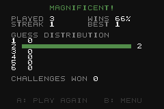

# Wordle GBA

Portage de Wordle sur Game Boy Advance : un mot de 5 lettres à deviner en
6 essais, feedback vert / jaune / gris, clavier virtuel au pad, deux langues
(français, anglais), statistiques sauvegardées en SRAM et un mode Challenge
déterministe. Écrit en C avec libtonc, sans assembleur ni C++.

| Titre | Menu | Partie | Résultat |
|---|---|---|---|
|  |  |  |  |

## Fonctionnalités

- Écran titre, menu (langue, mode, statistiques).
- **Mode Classique** : mot tiré au hasard parmi ~500 mots courants, sans
  répéter les 8 derniers mots joués.
- **Mode Challenge** : le challenge n° *n* est toujours le même mot (séquence
  pré-mélangée embarquée, indexée par le compteur de challenges terminés
  stocké en SRAM — pas besoin d'horloge). Un seul challenge en cours à la
  fois : la partie est sauvegardée à chaque essai et reprise si on quitte
  (SELECT) ou si on éteint la console.
- Validation des mots contre une liste large (~13 000 mots en anglais,
  ~6 600 en français, accents retirés comme dans les Wordle français).
- Clavier AZERTY en français, QWERTY en anglais, avec touches Entrée / Effacer.
- Statistiques persistantes (SRAM) : parties, victoires, série en cours,
  meilleure série, répartition par nombre d'essais, challenges réussis.
- Interface entièrement traduite dans la langue choisie.

## Contrôles

| Touche | Action |
|---|---|
| D-pad | Déplacer le curseur sur le clavier virtuel / naviguer dans les menus |
| A | Saisir la lettre sélectionnée (ou activer Entrée / Effacer sur le clavier) |
| B | Effacer la dernière lettre |
| START | Valider le mot |
| SELECT | Quitter la partie et revenir au menu |
| Gauche / Droite (menu) | Changer de langue |

## Compilation

Prérequis : [devkitPro](https://devkitpro.org/wiki/Getting_Started) avec le
groupe `gba-dev` (devkitARM, libtonc, gbafix), GNU make, Python 3 avec
[Pillow](https://pypi.org/project/pillow/) (génération des tuiles).

```sh
make            # -> build/wordle.gba
make run        # lance la ROM dans mGBA (variable MGBA pour changer le chemin)
make test       # tests unitaires de la logique, compilés avec le gcc hôte
make smoke      # test de bout en bout dans mGBA (voir plus bas)
make clean
```

Sous Windows, lancer `make` depuis le shell MSYS2 fourni par devkitPro
(`DEVKITPRO=/opt/devkitpro`). Si Python n'est pas dans le PATH de ce shell :
`make PYTHON="py -3"`.

La ROM déclare une sauvegarde SRAM (`SRAM_V113`) ; mGBA et les linkers de
flashcart la détectent automatiquement.

## Chaîne d'outils maison (pas de grit)

Tout ce qui est généré l'est à la compilation, dans `build/gen/` :

| Script | Rôle |
|---|---|
| `tools/make_assets.py` | Dessine les images sources `assets/*.png` (PNG indexés) à partir de pixel-art ASCII : police 6×7 (A-Z, 0-9, ponctuation, icônes Entrée/Effacer, segment de barre), cases 16×16 de la grille et touches arrondies du clavier avec la lettre pré-composée, sprite curseur, motif de fond du titre. `make assets` pour les régénérer. |
| `tools/png2gba.py` | Convertit un PNG en tuiles 4bpp + palette BGR555 sous forme de tableaux C. Option `--meta 2 2` (via `assets/<nom>.opts`) pour émettre les tuiles par métatuile 16×16. |
| `tools/gen_wordlist.py` | Transforme `data/<langue>_solutions.txt` et `data/<langue>_valid.txt` en tableaux C : solutions, mots valides triés (recherche dichotomique), permutation fixe pour le mode Challenge. |
| `tools/build_wordlists.py` | Reconstruit les fichiers `data/*.txt` depuis les sources externes (réseau nécessaire, `make wordlists`). |

Les couleurs (vert / jaune / gris / neutre) ne sont pas dans les tuiles : une
seule tuile par lettre, colorée par bank de palette (`SE_PALBANK`).

## Architecture

```
source/main.c        boucle de jeu, machine à états : titre / menu / jeu / résultat / stats
source/logic.c       règles de Wordle (score avec lettres répétées, validation, saisie) — sans dépendance matérielle
source/lang.c        table des langues : listes de mots, disposition clavier, textes
source/render.c      Mode 0 : BG0 texte, BG1 grille + clavier, BG2 motif titre, sprite curseur
source/keyboard.c    navigation du curseur sur le clavier virtuel
source/input.c       lecture des touches, auto-répétition du D-pad
source/stats.c       lecture / écriture SRAM (statistiques, challenge en cours, état du RNG)
source/rng.c         xorshift32
include/game_state.h état d'une partie (mot cible, essais, feedback, clavier)
include/stats.h      structure sauvegardée
```

Mémoire vidéo : charblock 0 = police, charblock 1 = cases et touches,
charblock 2 = motif ; screenblocks 28/29/30 ; l'unique sprite est le curseur.

## Tests

- `make test` : `tests/test_logic.c` compile `logic.c` avec le compilateur de
  l'hôte et vérifie le scoring (dont les lettres doublées), la validation, la
  saisie, la victoire / défaite et la mise à jour des couleurs du clavier.
- `make smoke` : `tests/smoke.py` pilote la ROM dans mGBA avec un script Lua
  (nécessite un mGBA avec l'option `--script`, disponible dans les builds de
  développement 0.11 : `--mgba` pour indiquer le chemin). Le script lit
  l'état du jeu en RAM (adresses tirées de l'ELF), tape des mots au clavier
  virtuel, gagne une partie, vérifie les statistiques, quitte et reprend un
  Challenge, puis redémarre la ROM pour vérifier la persistance SRAM. Les
  captures d'écran vont dans `tests/out/`.

## Sources des listes de mots

- Anglais : liste des solutions et des mots acceptés du Wordle original ;
  classement par fréquence via
  [FrequencyWords](https://github.com/hermitdave/FrequencyWords) (CC BY-SA 4.0).
- Français : [Lexique 3.83](http://www.lexique.org) (CC BY-SA 4.0) pour les
  formes, lemmes, catégories grammaticales et fréquences ;
  [an-array-of-french-words](https://github.com/words/an-array-of-french-words)
  (MIT) pour élargir la liste des mots acceptés.

Les solutions sont les 500 lemmes les plus fréquents (noms, adjectifs,
verbes, adverbes de 5 lettres après suppression des accents), moins une courte
liste d'exclusion. Le code est sous licence MIT (voir `LICENSE`).
