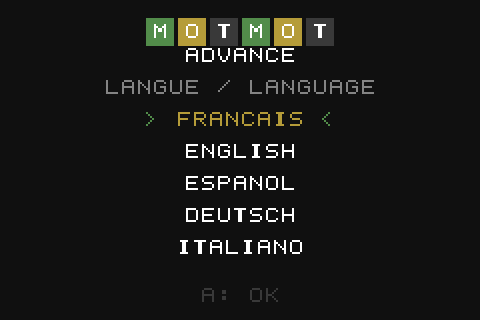

# MotMot Advance

*Version française : [README.fr.md](README.fr.md)*

A word-guessing game for the Game Boy Advance.

<p align="center">
  
  &nbsp;&nbsp;
  
</p>
<p align="center"><a href="assets/market/Mot.Mot.Advance-thumb-video.mp4">Trailer (mp4)</a></p>

<p align="center">
  
  
  
  
  
</p>
<p align="center"><sub>Title · Menu · Game · Marathon · Time Attack</sub></p>

## Features

- Language selection: French, English, Spanish, German, Italian
- **Classic mode**: a random word among ~500 common words, never repeating
  the last 8 words played.
- **Marathon mode**: random words one after another, with lives and a saved
  high score per difficulty. Easy: 3 lives, a missed word costs one. Hard:
  5 lives, every guess from the third one costs one — solve fast or bleed.
- **Time Attack**: 5, 10 or 15 words to solve as fast as possible
- Guesses are validated against a large list per language (4,900 to 8,700 words)
- Persistent statistics saved in the cartridge SRAM

## Controls

| Button | Action |
|---|---|
| D-pad | Move the cursor on the virtual keyboard / navigate menus |
| A | Type the selected letter (or activate Enter / Backspace on the keyboard) |
| B | Delete the last letter |
| START | Submit the word |
| SELECT | Quit the game — a modal box asks for confirmation and hides the grid. In Time Attack there is no pause: SELECT abandons the run at once |
| Left / Right | Change an option, turn the Records pages, move between initials |

## Building

Requirements: [devkitPro](https://devkitpro.org/wiki/Getting_Started) with the
`gba-dev` group (devkitARM, libtonc, gbafix), GNU make, Python 3 with
[Pillow](https://pypi.org/project/pillow/) (tile generation).

```sh
make            # -> build/motmot.gba
make run        # launch the ROM in mGBA (override the path with MGBA=...)
make test       # unit tests on the host (tests/unit)
make emutest    # scenarios played in mGBA (tests/emu)
make check      # both
make demo       # re-record docs/demo.gif and docs/demo_en.gif in mGBA
make clean
```

On Windows, run `make` from the MSYS2 shell shipped with devkitPro
(`DEVKITPRO=/opt/devkitpro`). If Python is not on that shell's PATH:
`make PYTHON="py -3"`.

The ROM declares an SRAM save (`SRAM_V113`); mGBA and flash-cart loaders
detect it automatically.

## Asset toolchain

Everything generated is produced at build time in `build/gen/`:

| Script | Purpose |
|---|---|
| `tools/make_assets.py` | Draws the source images `assets/*.png` (indexed PNGs) from ASCII pixel art: 6×7 font (A-Z, 0-9, punctuation, Enter/Backspace icons, bar segment), 16×16 grid cells and rounded keyboard keys with the letter pre-composed, cursor sprite, title background pattern. `make assets` regenerates them. |
| `tools/png2gba.py` | Converts a PNG into 4bpp tiles + BGR555 palette as C arrays. `--meta 2 2` (through `assets/<name>.opts`) emits tiles in 16×16 metatile order. |
| `tools/gen_wordlist.py` | Turns `data/<lang>_solutions.txt` and `data/<lang>_valid.txt` into C tables: solutions and sorted valid words (binary search). |
| `tools/build_wordlists.py` | Rebuilds the `data/*.txt` files from the external sources (needs network, `make wordlists`). |
| `tools/make_demo.py` | Records `docs/demo.gif` (French) and `docs/demo_en.gif` (English): plays `tools/demo.lua` in mGBA through the test library, grabbing one frame out of three (`make demo`). |

## Architecture

```
source/main.c        game loop and screens: language / title / menu / options / records / mode select / game / results / stats
source/logic.c       game rules (scoring with repeated letters, validation, typing) — no hardware dependency
source/lang.c        language table: word lists, keyboard layout, UI strings
source/render.c      Mode 0: BG0 text, BG1 grid + keyboard, BG2 title pattern, cursor sprite
source/sound.c       PSG sound effects: step sequencer on square 1, square 2 and noise
source/keyboard.c    cursor navigation over the virtual keyboard
source/input.c       key polling, D-pad auto-repeat
source/stats.c       SRAM read / write (statistics, RNG state, options)
source/rng.c         xorshift32
source/time_attack.c time formatting and leaderboards (pure, host-tested)
include/game_state.h state of one round (target, guesses, feedback, keyboard colours)
include/stats.h      saved data layout
```

Video memory and display: charblock 0 = font (+ title pattern), charblock 1 = cells and
keys; screenblocks 28/29/30. BG2 is a second text layer scrolled 4 px so
that odd-length centred strings share the exact centre of even ones; it also
carries the title pattern and the opaque modal box. The only sprite is the
cursor.

## Tests

See [tests/README.md](tests/README.md).

- `make test` — 101 unit tests on the host: the game modules (rules, keyboard,
  RNG, SRAM persistence, sound sequencer, Time Attack leaderboards, language
  tables and word lists) are
  compiled with `gcc` against a shim that replaces the GBA registers and SRAM
  with plain memory.
- `make emutest` — 14 scenarios played in mGBA by Lua scripts (boot, menu,
  keyboard, classic win/loss, quit confirmation, Marathon easy/hard/game over,
  Time Attack with initials and leaderboards, sound switch, language switch,
  SRAM persistence across a reboot, random
  input for 30000 frames). Assertions read the ROM's RAM; the emulator runs
  unthrottled so the whole suite takes about 15 s. Needs an mGBA 0.11
  development build (`--script`).
- `make check` — both.

## Word list sources

- English: [an-array-of-english-words](https://github.com/words/an-array-of-english-words)
  (MIT) as the dictionary; frequency ranking from
  [FrequencyWords](https://github.com/hermitdave/FrequencyWords)
  (OpenSubtitles, CC BY-SA 4.0); the
  [google-10000-english](https://github.com/first20hours/google-10000-english)
  list to keep only everyday words as solutions; a first-names list to drop
  proper nouns.
- French: [Lexique 3.83](http://www.lexique.org) (CC BY-SA 4.0) for forms,
  lemmas, part of speech and frequencies;
  [an-array-of-french-words](https://github.com/words/an-array-of-french-words)
  (MIT) to widen the accepted-word list.
- Spanish and German: the Letterpress word lists
  ([lorenbrichter/Words](https://github.com/lorenbrichter/Words), CC0) ranked
  by OpenSubtitles frequency, first names removed.
- Italian: [paroleitaliane](https://github.com/napolux/paroleitaliane) (MIT)
  ranked by OpenSubtitles frequency.

Solutions are the 500 most frequent everyday words of each language (French:
5-letter nouns, adjectives, verbs and adverbs after accent stripping), minus
a short block list per language.

© 2026 Khopa, MIT licence (see `LICENSE`)
