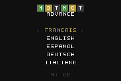

# Wordle GBA

*Version française : [README.fr.md](README.fr.md)*

A Wordle port for the Game Boy Advance: guess a 5-letter word in 6 tries with
green / yellow / grey feedback, a D-pad driven virtual keyboard, two languages
(French and English), statistics saved to SRAM and a deterministic Challenge
mode. Written in C with libtonc — no assembly, no C++.

| Title | Language | Menu | Game | Result |
|---|---|---|---|---|
|  |  |  |  |  |

## Features

- Language selection at boot, title screen, menu (mode, statistics, language).
- **Classic mode**: a random word among ~500 common words, never repeating
  the last 8 words played.
- **Challenge mode**: challenge #*n* is always the same word (an embedded
  pre-shuffled sequence indexed by the number of completed challenges stored
  in SRAM — no clock needed). Only one Challenge can be in progress: it is
  saved after every guess and resumed if you quit (SELECT) or power off.
- Guesses are validated against a large list (~13,000 English words,
  ~6,600 French words; accents are stripped as in French Wordle clones).
- AZERTY layout in French, QWERTY in English, with Enter / Backspace keys.
- Persistent statistics (SRAM): games played, wins, current streak, best
  streak, guess distribution, challenges won.
- The whole interface is translated into the selected language.

## Controls

| Button | Action |
|---|---|
| D-pad | Move the cursor on the virtual keyboard / navigate menus |
| A | Type the selected letter (or activate Enter / Backspace on the keyboard) |
| B | Delete the last letter |
| START | Submit the word |
| SELECT | Quit the game and return to the menu |
| Left / Right (menu) | Switch language |

## Building

Requirements: [devkitPro](https://devkitpro.org/wiki/Getting_Started) with the
`gba-dev` group (devkitARM, libtonc, gbafix), GNU make, Python 3 with
[Pillow](https://pypi.org/project/pillow/) (tile generation).

```sh
make            # -> build/wordle.gba
make run        # launch the ROM in mGBA (override the path with MGBA=...)
make test       # unit tests of the game logic, built with the host gcc
make smoke      # end-to-end test in mGBA (see below)
make clean
```

On Windows, run `make` from the MSYS2 shell shipped with devkitPro
(`DEVKITPRO=/opt/devkitpro`). If Python is not on that shell's PATH:
`make PYTHON="py -3"`.

The ROM declares an SRAM save (`SRAM_V113`); mGBA and flash-cart loaders
detect it automatically.

## Home-made toolchain (no grit)

Everything generated is produced at build time in `build/gen/`:

| Script | Purpose |
|---|---|
| `tools/make_assets.py` | Draws the source images `assets/*.png` (indexed PNGs) from ASCII pixel art: 6×7 font (A-Z, 0-9, punctuation, Enter/Backspace icons, bar segment), 16×16 grid cells and rounded keyboard keys with the letter pre-composed, cursor sprite, title background pattern. `make assets` regenerates them. |
| `tools/png2gba.py` | Converts a PNG into 4bpp tiles + BGR555 palette as C arrays. `--meta 2 2` (through `assets/<name>.opts`) emits tiles in 16×16 metatile order. |
| `tools/gen_wordlist.py` | Turns `data/<lang>_solutions.txt` and `data/<lang>_valid.txt` into C tables: solutions, sorted valid words (binary search), fixed permutation for Challenge mode. |
| `tools/build_wordlists.py` | Rebuilds the `data/*.txt` files from the external sources (needs network, `make wordlists`). |

Colours (green / yellow / grey / neutral) are not baked into the tiles: there
is one tile set per letter, coloured through palette banks (`SE_PALBANK`).

## Architecture

```
source/main.c        game loop, screen state machine: language / title / menu / game / result / stats
source/logic.c       Wordle rules (scoring with repeated letters, validation, typing) — no hardware dependency
source/lang.c        language table: word lists, keyboard layout, UI strings
source/render.c      Mode 0: BG0 text, BG1 grid + keyboard, BG2 title pattern, cursor sprite
source/keyboard.c    cursor navigation over the virtual keyboard
source/input.c       key polling, D-pad auto-repeat
source/stats.c       SRAM read / write (statistics, in-progress challenge, RNG state)
source/rng.c         xorshift32
include/game_state.h state of one round (target, guesses, feedback, keyboard colours)
include/stats.h      saved data layout
```

Video memory: charblock 0 = font, charblock 1 = cells and keys,
charblock 2 = pattern; screenblocks 28/29/30; the only sprite is the cursor.

## Tests

- `make test`: `tests/test_logic.c` compiles `logic.c` with the host compiler
  and checks scoring (including doubled letters), validation, typing,
  win / loss and keyboard colour updates.
- `make smoke`: `tests/smoke.py` drives the ROM in mGBA with a Lua script
  (needs an mGBA with the `--script` option, available in the 0.11
  development builds; use `--mgba` to point at it). The script reads the game
  state from RAM (addresses taken from the ELF), types words on the virtual
  keyboard, wins a game, loses a game, checks the statistics, quits and
  resumes a Challenge, then reboots the ROM to verify SRAM persistence.
  Screenshots land in `tests/out/`.

## Word list sources

- English: the original Wordle solution and allowed-guess lists; frequency
  ranking from [FrequencyWords](https://github.com/hermitdave/FrequencyWords)
  (CC BY-SA 4.0).
- French: [Lexique 3.83](http://www.lexique.org) (CC BY-SA 4.0) for forms,
  lemmas, part of speech and frequencies;
  [an-array-of-french-words](https://github.com/words/an-array-of-french-words)
  (MIT) to widen the accepted-word list.

Solutions are the 500 most frequent lemmas (5-letter nouns, adjectives,
verbs and adverbs after accent stripping), minus a short block list.

Code © 2026 Clément Perreau, MIT licence (see `LICENSE`). Published by Khopa.
